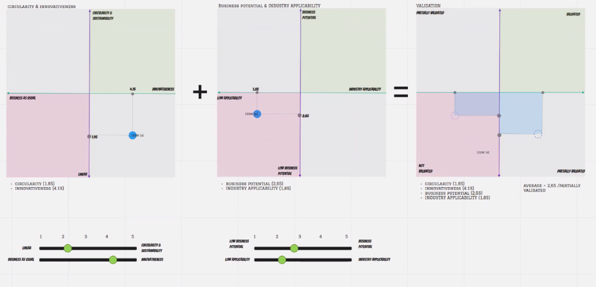
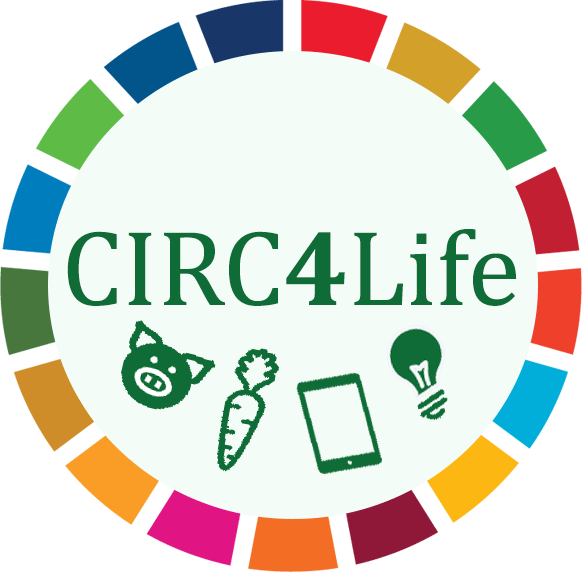

# circ4life-oic2-validation-visualisation

This is a simple interactive visualization of a 4 dimensional rating.

## Concept

The basic Idea for this tool is to feature 4 sliders to
set a rating in 4 dimensions.
This 4 dimensional rating is then to be visualized as illustrated in the following
sketch by [Laurea](https://www.laurea.fi/en/).

## CIRC4Life

This work is part of the CIRC4Life ( https://www.circ4life.eu/ ) project
which received funding from the European Union’s Horizon 2020 research and innovation program under grant agreement No 776503.

## License

Copyright 2021 European EPC Competence Center GmbH (EECC) <info@eecc.info>

<a href="https://www.gnu.org/licenses/agpl-3.0.html" target="_blank">
 

All code published in this repository is free software: you can redistribute it and/or modify
it under the terms of the GNU Affero General Public License as published by
the Free Software Foundation, either version 3 of the License, or
(at your option) any later version.
</a>

This program is distributed in the hope that it will be useful,
but WITHOUT ANY WARRANTY; without even the implied warranty of
MERCHANTABILITY or FITNESS FOR A PARTICULAR PURPOSE.  See the
GNU Affero General Public License for more details.
